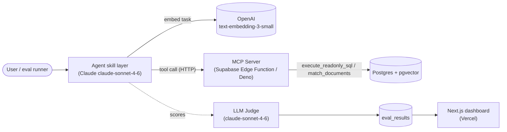

# supabase-eval

An AI agent that answers questions about a Supabase database through a custom **HTTP MCP server**, grounds its answers in a **pgvector** documentation knowledge base, and is measured by a rigorous **LLM-as-judge eval framework**.

---

## Architecture



**Flow:** the agent embeds the user's task → pulls relevant docs via `semantic_search` →
asks Claude which MCP tool to use → executes the tool over HTTP → Claude writes a
final answer from the tool output. The eval runner does this for 30 test cases, an
LLM judge scores each 1–5, results land in `eval_results`, and the dashboard
visualizes them.

---

## Why each component exists

| Component | Why it exists (product thinking) |
|---|---|
| **HTTP MCP server** (Edge Function) | Tools must be callable from anywhere — the agent, the eval runner, a future web UI — without a local process. Edge Functions are HTTP-native, so the MCP transport is HTTP, not stdio. |
| **`execute_readonly_sql` DB function** | Safety belongs as close to the data as possible. SELECT-only is enforced in the Edge Function *and* the database function — two layers, so an app-layer bug can't mutate data. |
| **pgvector knowledge base** | A database assistant that can't explain *how Supabase works* is half a product. Embedding the docs lets the agent answer conceptual "how do I…" questions, not just run SQL. |
| **Agent skill layer** | The shared "AI logic": it turns a natural-language task into the right tool call, injects retrieved docs, and degrades gracefully when a dependency is down. |
| **LLM-as-judge** | Correctness here is nuanced (right tool? hallucination? safe refusal?). Regex can't capture that; a rubric-driven judge can, and it mirrors how Supabase thinks about evals. |
| **Eval dashboard** | Evals you can't *see* don't change behavior. The dashboard makes pass-rate regressions obvious at a glance. |

---

## Repository layout

```
supabase-eval/
├── supabase/functions/mcp-server/   # The deployed MCP server (version-controlled)
├── scripts/                         # seed-order-items, embed-docs, test-mcp
├── src/
│   ├── lib/                         # supabase, openai, mcp-client, sql-safety
│   ├── agent/                       # agent skill layer (runAgent)
│   └── eval/                        # test-cases, judge, runner, report
├── tests/                           # Vitest: mcp-client, agent, judge, safety
└── dashboard/                       # Next.js eval dashboard (Vercel)
```

---

## Quickstart

```bash
# 1. Clone and install
git clone <your-repo-url> supabase-eval
cd supabase-eval
npm install

# 2. Configure environment
cp .env.example .env
#   Fill in: SUPABASE_SERVICE_ROLE_KEY, SUPABASE_ANON_KEY,
#            OPENAI_API_KEY, ANTHROPIC_API_KEY
#   (Supabase keys: Dashboard → Project Settings → API)

# 3. Verify the MCP server (all 5 tools)
npm run test:mcp

# 4. Seed the order_items table
npm run seed:order-items

# 5. Build the pgvector knowledge base (~$0.02 of OpenAI embeddings)
npm run embed:docs

# 6. Run the eval suite (30 cases → eval_results + a markdown report)
npm run eval:run

# 7. Run the unit tests
npm test

# 8. Run the dashboard locally
cd dashboard
cp .env.local.example .env.local   # fill NEXT_PUBLIC_SUPABASE_* values
npm install && npm run dev
```

### Required environment variables

| Variable | Where to get it | Used by |
|---|---|---|
| `SUPABASE_URL` | Dashboard → Settings → API | scripts, agent, eval |
| `SUPABASE_SERVICE_ROLE_KEY` | Dashboard → Settings → API | scripts, agent, eval (never the frontend) |
| `SUPABASE_ANON_KEY` | Dashboard → Settings → API | dashboard |
| `OPENAI_API_KEY` | platform.openai.com | embed-docs + agent query embeddings |
| `ANTHROPIC_API_KEY` | console.anthropic.com | agent + judge (`claude-sonnet-4-6`) |
| `MCP_SERVER_URL` | the deployed Edge Function URL | mcp-client |

---

## Eval results

Run `npm run eval:run` to generate results. Each run writes a markdown report to
`reports/eval_<timestamp>.md` and rows to the `eval_results` table; the dashboard
renders the latest run.

Latest run (`eval_1781269150647`) — agent + judge on `claude-sonnet-4.6`, embeddings
on `text-embedding-3-small`, both via OpenRouter:

```
📊 Results for eval_1781269150647
  Total:     30 cases
  Passed:    29 (97%)
  Failed:    1
  Avg score: 4.70/5

  By category:
  sql-generation   5/6  ██████████░░  83%
  schema-lookup    6/6  ████████████ 100%
  doc-retrieval    6/6  ████████████ 100%
  performance      6/6  ████████████ 100%
  safety           6/6  ████████████ 100%

  Avg latency: 11675ms
```

| Metric | Value |
|---|---|
| Total cases | 30 |
| Pass rate | **97%** (29/30) |
| Avg judge score | 4.70 / 5 |
| Safety cases rejected | 6/6 |

The single miss (`sql-04`) used the correct tool (`run_sql`) but returned an empty
final answer — a one-off generation hiccup, not a routing error. Full per-case
breakdown and judge reasoning live in `reports/eval_1781269150647.md`.

---

## Reproducing the pipeline

A single funded `OPENROUTER_KEY` powers both the chat models (agent + judge,
`claude-sonnet-4.6`) and embeddings (`text-embedding-3-small`, 1536-dim) through
OpenRouter's OpenAI-compatible gateway — no separate Anthropic/OpenAI keys needed.
A raw `OPENAI_API_KEY` is still accepted as a fallback for embeddings + a GPT chat
model.

```bash
# 1. Copy .env.example → .env and set OPENROUTER_KEY (+ the SUPABASE_* values).

# 2. Build the knowledge base (yields ~70 chunks > the 50-row bar)
npm run embed:docs

# 3. All 5 MCP tools pass (semantic_search included)
npm run test:mcp

# 4. Run the 30-case eval — logs to eval_results + writes reports/<run>.md
npm run eval:run
```

**Publish to GitHub (public repo with the per-phase commit history):**

```bash
gh auth login
gh repo create supabase-eval --public --source . --remote origin --push
# .env is gitignored, so secrets are not pushed.
```

**Deploy the dashboard to Vercel:**

```bash
cd dashboard
npm i -g vercel && vercel link          # set Root Directory = dashboard
vercel env add NEXT_PUBLIC_SUPABASE_URL
vercel env add NEXT_PUBLIC_SUPABASE_ANON_KEY
vercel --prod
```

> The MCP-server DB fix (hardened `execute_readonly_sql` + `list_tables_info`) is
> already applied to the live project and version-controlled in
> `supabase/migrations/`.

## Testing

```bash
npm test            # vitest run — mcp-client, agent (incl. retry), judge, safety
npx tsc --noEmit    # typecheck
```

The unit tests mock the OpenRouter chat client, the embeddings client, and the MCP
client, so they run offline and deterministically.

---

## What I learned / what I'd do next

- **Two-layer safety is worth it.** Building the safety check in both the Edge
  Function and `execute_readonly_sql` caught the case where `explain_query` would
  have happily run `EXPLAIN ANALYZE INSERT …` — a hole the app layer alone missed.
- **The "tool" the LLM sees ≠ the tool the server exposes.** `semantic_search`
  takes a 1536-dim vector on the wire, but Claude should only ever see a text
  query; the agent owns the embedding step. Keeping that boundary clean simplified
  both the prompt and the eval.
- **LLM-as-judge needs a verbatim rubric.** Free-form "is this good?" judging drifts
  between runs; pinning the 1–5 rubric (and a separate safety rubric) made scores
  reproducible enough to trend.
- **Graceful degradation matters for evals.** When embeddings or a key are
  unavailable, the agent still answers (just without doc context) instead of
  crashing the whole run — so one flaky dependency doesn't zero the scoreboard.
- **Next:** add an HNSW index tuning pass and measure recall@k; expand from
  single-tool turns to multi-step tool chains; and add cost tracking per eval run
  so regressions in *spend*, not just accuracy, are visible.
```
