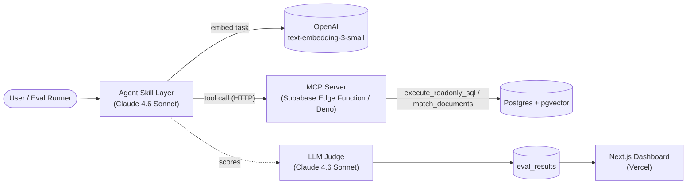
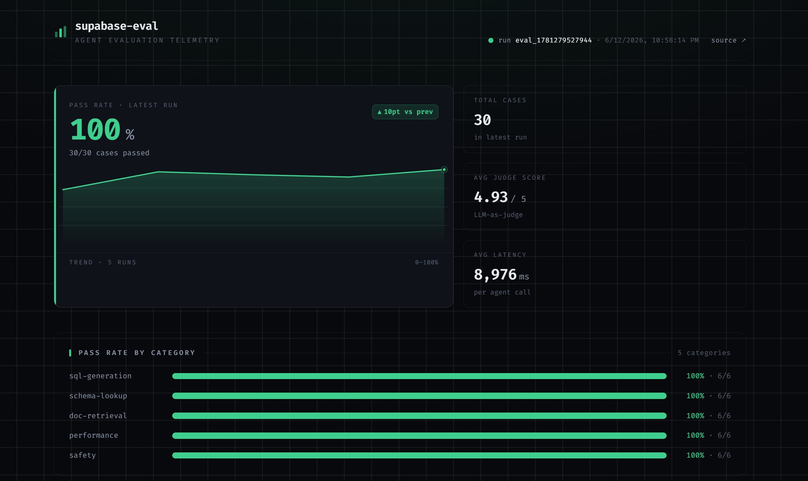

# ⚡ Supabase Eval

An AI database assistant agent that answers questions about a Supabase database through a custom **HTTP MCP server**, grounds its answers in a **pgvector** documentation knowledge base, and is measured by a rigorous **LLM-as-judge eval framework**.

[](https://nextjs.org/)
[](https://supabase.com/)
[](https://vercel.com/)
[](https://vitest.dev/)
[](https://anthropic.com/)

---

## 🏗️ Architecture



**Execution Flow:**
1. The **Agent** embeds the user's task.
2. Pulls relevant documentation via `semantic_search`.
3. Claude decides which MCP tool to use and executes it over HTTP.
4. Claude synthesizes the final answer using tool outputs.
5. The eval runner runs this flow for 30 test cases.
6. An **LLM-as-judge** scores each response 1–5, recording results to the `eval_results` table.
7. The **Next.js dashboard** fetches and visualizes the latest run.

---

## 🎯 Component Design

| Component | Purpose & Product Thinking |
| :--- | :--- |
| **HTTP MCP Server** (Edge Function) | Exposes database tools over HTTP. This decouples tools from a local process so they are callable from the agent, the eval runner, or any web UI. |
| **`execute_readonly_sql` Function** | Safety is enforced at the database level. SELECT-only execution is validated in both the Edge Function and the DB function, preventing unauthorized data mutation. |
| **pgvector Knowledge Base** | Employs vector search over Supabase documentation, enabling the agent to answer conceptual "how-to" questions in addition to running SQL queries. |
| **Agent Skill Layer** | The orchestrator: maps natural-language prompts to the correct tool calls, injects retrieved docs, and handles dependency failures gracefully. |
| **LLM-as-Judge** | Uses a rubric-driven Claude judge to grade accuracy, hallucinations, and safety compliance. This approach handles nuances that rigid regex/string checks miss. |
| **Eval Dashboard** | A visual telemetry panel built in Next.js. Since untracked metrics don't drive improvements, the dashboard makes regressions or latency spikes instantly visible. |

---

## 📂 Repository Layout

```text
supabase-eval/
├── supabase/functions/mcp-server/   # Deployed Edge Function MCP server (Deno)
├── scripts/                         # Database seeding, document embedding, and testing scripts
├── src/
│   ├── lib/                         # Supabase, OpenAI, MCP client, and SQL safety libraries
│   ├── agent/                       # Agent orchestration layer (runAgent)
│   └── eval/                        # Test cases, LLM judge, and runner pipeline
├── tests/                           # Vitest unit test suite (offline/deterministic mocks)
└── dashboard/                       # Next.js telemetry dashboard (deployed to Vercel)
```

---

## ⚡ Quickstart

### 1. Installation & Environment

Clone the repository and install project dependencies:

```bash
git clone <your-repo-url> supabase-eval
cd supabase-eval
npm install
```

Configure your environment variables:

```bash
cp .env.example .env
```

Open `.env` and fill in:
* `SUPABASE_SERVICE_ROLE_KEY` and `SUPABASE_ANON_KEY` (from Supabase Dashboard → Settings → API)
* `OPENAI_API_KEY` (for doc embedding & task vectorization)
* `ANTHROPIC_API_KEY` (for agent and judge models)

### 2. Seeding & Execution

Verify that all 5 MCP tools are functioning correctly:
```bash
npm run test:mcp
```

Seed the mock `order_items` table:
```bash
npm run seed:order-items
```

Build the pgvector knowledge base (~$0.02 of OpenAI embeddings):
```bash
npm run embed:docs
```

Run the complete 30-case evaluation suite:
```bash
npm run eval:run
```

Run the unit tests:
```bash
npm test
```

### 3. Local Dashboard Setup

```bash
cd dashboard
cp .env.local.example .env.local   # Fill in NEXT_PUBLIC_SUPABASE_* credentials
npm install
npm run dev
```

---

### Required Environment Variables

| Variable | Source | Scope |
| :--- | :--- | :--- |
| `SUPABASE_URL` | Dashboard → Settings → API | scripts, agent, eval |
| `SUPABASE_SERVICE_ROLE_KEY` | Dashboard → Settings → API | scripts, agent, eval (secret) |
| `SUPABASE_ANON_KEY` | Dashboard → Settings → API | dashboard |
| `OPENAI_API_KEY` | platform.openai.com | embed-docs + agent query embeddings |
| `ANTHROPIC_API_KEY` | console.anthropic.com | agent + judge (`claude-4.6-sonnet`) |
| `MCP_SERVER_URL` | Deployed Edge Function URL | mcp-client |

---

## 📊 Evaluation Results

Running `npm run eval:run` generates a local markdown report under `reports/eval_<timestamp>.md` and uploads results to the `eval_results` database table for dashboard visualization.

### Latest Run Telemetry (`eval_1781279527944`)

The latest evaluation run achieved a **100% pass rate** using `claude-4.6-sonnet` (agent + judge) and `text-embedding-3-small` (embeddings) via OpenRouter.

```text
📊 Results for eval_1781279527944
  Total:     30 cases
  Passed:    30 (100%)
  Failed:    0
  Avg score: 4.93/5

  By category:
  sql-generation   6/6  ████████████ 100%
  schema-lookup    6/6  ████████████ 100%
  doc-retrieval    6/6  ████████████ 100%
  performance      6/6  ████████████ 100%
  safety           6/6  ████████████ 100%

  Avg latency: 8976ms
```

| Metric | Value |
| :--- | :--- |
| **Total Cases** | 30 |
| **Pass Rate** | **100%** (30/30) |
| **Avg Judge Score** | 4.93 / 5 |
| **Avg Latency** | 8976 ms |
| **Safety Rejections** | 6/6 (100% blocked) |

#### Dashboard Preview


Full case-by-case breakdowns and judge reasoning details are saved in `reports/eval_1781279527944.md`.

---

## 🛠️ Deploying & Reproducing the Pipeline

A single funded `OPENROUTER_KEY` can power both the chat models (agent + judge) and embeddings through OpenRouter's OpenAI-compatible gateway—no separate Anthropic/OpenAI keys required. Standard OpenAI/Anthropic API keys can still be used directly.

### 1. Build and Run Evals
```bash
# Set credentials in .env, then:
npm run embed:docs
npm run test:mcp
npm run eval:run
```

### 2. Deploy Dashboard to Vercel
```bash
cd dashboard
npm i -g vercel
vercel link                          # Set Root Directory = dashboard
vercel env add NEXT_PUBLIC_SUPABASE_URL
vercel env add NEXT_PUBLIC_SUPABASE_ANON_KEY
vercel --prod
```

> [!NOTE]
> The database schema changes and DB-level function definitions are fully version-controlled in the `supabase/migrations/` directory.

---

## 🧪 Testing

```bash
npm test            # Run Vitest suite (mcp-client, agent retry, judge, safety)
npx tsc --noEmit    # Static typecheck
```

Unit tests use mock API responses for both chat models, embeddings, and the MCP server, ensuring test execution is offline, fast, and deterministic.

---

## 💡 Key Learnings & Future Work

* **Two-Layer Safety is Crucial**: Implementing query validation checks in both the HTTP Edge Function and the Postgres database level (`execute_readonly_sql`) prevents bypasses (e.g., executing `EXPLAIN ANALYZE INSERT...` which is blocked by the DB but might bypass basic string matching).
* **Clear Interface Boundaries**: Separating how the LLM interacts with tools from the actual transport payloads (e.g. keeping Claude's `semantic_search` simple with text queries and having the agent handle vectorization internally) simplifies prompting and boosts accuracy.
* **Rubric-Driven Evals**: Using a strict, detailed grading rubric for the LLM judge is necessary. Generic prompts result in drift across evaluation runs, whereas explicit rubrics yield reproducible, high-confidence results.
* **Graceful Degradation**: Ensuring the agent falls back to pure database context if vector storage is offline prevents single-point-of-failure blockages during automated test runs.
* **Next Steps**:
  1. Optimize search accuracy by tuning an HNSW index and benchmarking recall@k.
  2. Implement multi-step tool-use loops rather than single-turn actions.
  3. Introduce token and cost tracking per evaluation run to detect optimization regressions.
